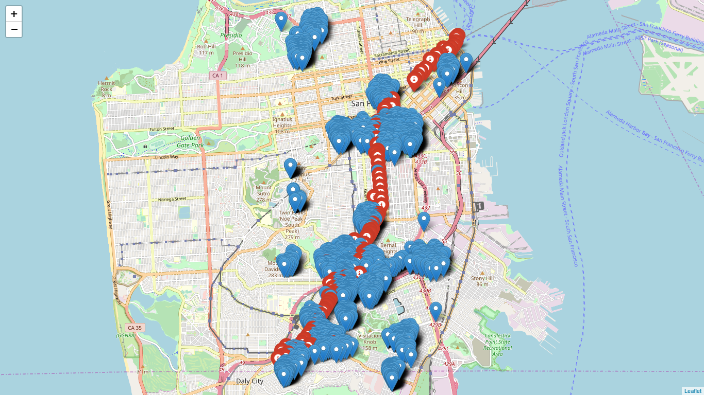
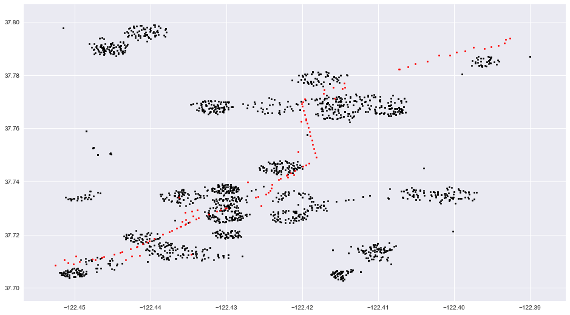
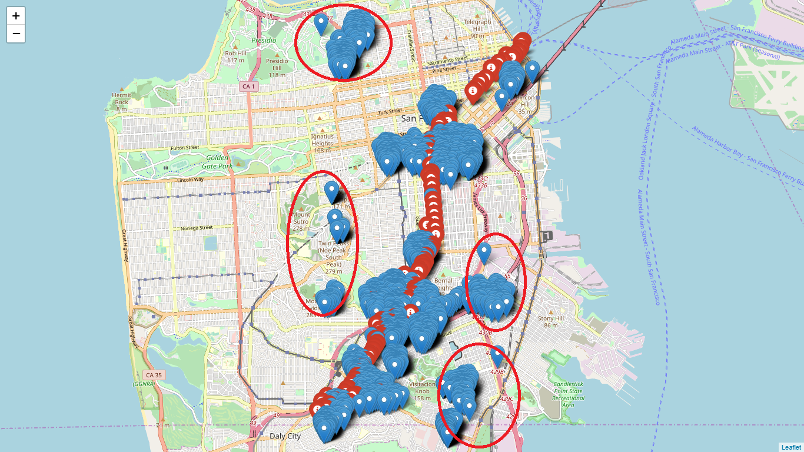
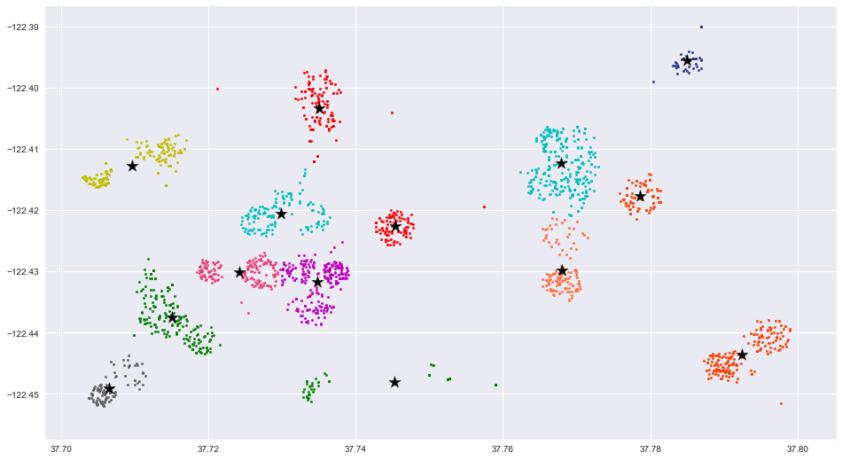
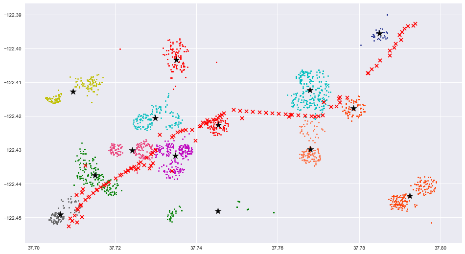

# HOMEWORK 1

## PROBLEM
You have been given 2 dataset files. They contains:

- 2191 rows with address + employee_id .
- 119 rows with Street_One + Street_Two . 

You should write an algorithm that returns the best 10 stops in your opinion .
>Simplify, It has a high probability of being the best stops.

## AT FIRST SIGHT

1. Convert data to coordinates

    * Using https://developer.here.com API to get coordinates from address's employee and from intersection streets ( bus stop ).

    * Saving new converted data to csv. coordinates_bus.csv and coordinates_emp.csv correlated coordinates_bus.csv and coordinates_emp.csv.
    > Because of complicated intersection Geocode API URL, I can't get 10 bus stops coordinates_emp. ( Ex: ANGELOS ALY. The real name is ANGELO'S ALY ).
    * Plotting it by folium.

    

2. Preparation

    > I weren't able to calculate the **walk minute distance** , so this makes sense for using **Planar Graph** and **Euclidean Distance**.

    

    **Note** : 
    - Black is employee point.
    - Red is bus stop point.
3. Analytics

    The map has many points that is far away from bus stop. That means the employees from there aren't able to walk to the bus stop. It's unreasonable.  Therefore, They were removed from calculation.

    Beside, We have 10 bus stops, so I decided **14** clusters. They are 4 removed cluster and 10 clusters for each bus stops.
    
    > Using K-means cluster.

    Map Clustering

    

    Map Planar Graph

    

    **Note** : 
    - Start is centroid point of cluster.
    - Each cluster has specific color.

    Map Planar Graph

    

    **Note** : 
    - Plotting bus stop with red cross.

4. Calculation

    From now, the problem is not the problem. To find the most efficient bus stops, I find the bus stop that are closest to centroids. I calculated exhaustively for every combination of cluster with each bus stops and then take the lowest distance.

    The result is:
    - 29TH ST
    - OLIVER ST
    - LASKIE ST
    - AMAZON AVE
    - EXCELSIOR AVE
    - BOSWORTH ST
    - 12TH ST
    - FREMONT ST
    - TRUMBULL ST
    - ERIE ST

